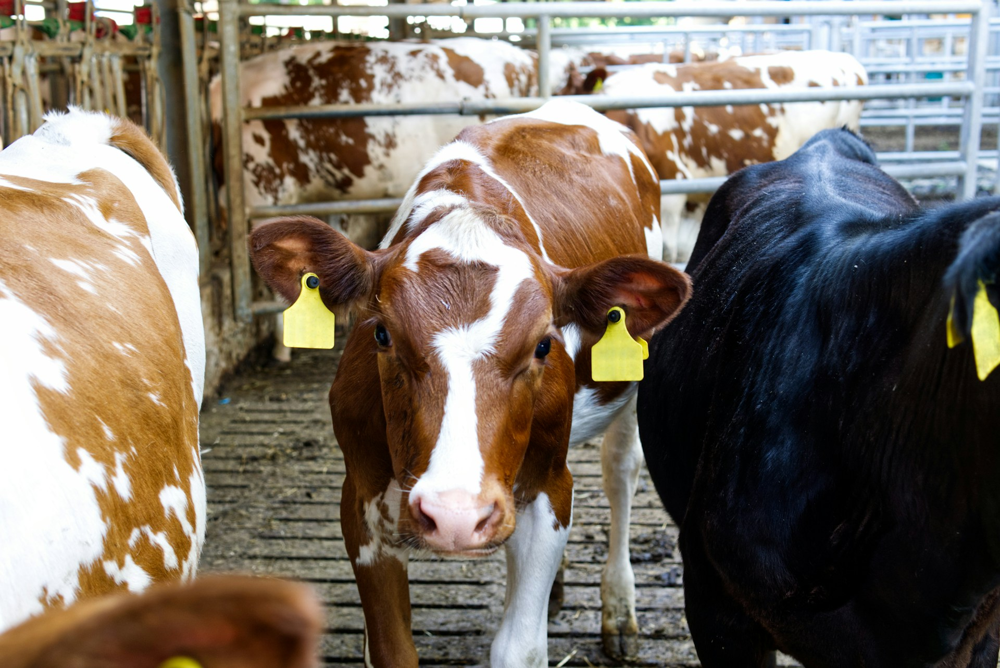

# CAETEC ~ Cow Queue Analysis

Automated cow detection and counting system for dairy farm queue monitoring using computer vision, with snapshots taken at 5-minute intervals.



## 🎯 Overview

This project implements an automated cow counting system using YOLOv8 object detection to monitor milking queue occupancy in dairy farms. The system:

- Processes images captured every 5 minutes by a camera installed at the milking queue.
- Detects individual cows using bounding boxes.
- Mantains a time-series log of queue occupancy.
- Provides insights into queue patterns throughout the day.

## ⭐ Highlights

- **Automated Monitoring**: captures queue images every 5 minutes.
- **Precise Detection**: 95% accuracy in cow counting using YOLOv8.

## 📊 Key Metrics

| Metric               | Value         |
| -------------------- | ------------- |
| Average precision    | 0.91          |
| Queue Count Accuracy | 95%           |
| Processing time      | <3s per image |
| Monitoring interval  | 5 minutes     |

## 🔬 Technical Stack

- **CV Framework**: YOLOv8 for object detection
- **Deployment**: Docker containerized
- **Storage**: AWS S3 for image storage

## 📁 Project Overview

```{bash}
notebooks/
├── yolo/              # 🌟 Production YOLOv8 Implementation
├── previous_models/   # Model Experiments
└── exploratory/       # Data Investigation
```

## 📚 Documentation

- Installation guide
- Development guide
- Model training
- System architecture
